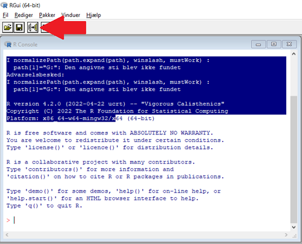

```{r setup, include=FALSE}

# install package management tool pacman
# install.packages("pacman")

knitr::opts_chunk$set(echo = TRUE, warning = FALSE, message = FALSE) 

```


## Intro

This brief README walks you through installing and using the process data application.

As deploying the app directly on our company servers is a complex issue, we will use a local
(and perhaps slightly less straightforward) installation as a workaround. As the installation
of R and the packages used are pretty stable, you should not run into any issues. 

**Note** </br>
The App was written in R {shiny} and using the {golem} framework. 
If an R-savy user wants to make changes to the app, all development files can be found here:
`F:\10 Cannabis\10_Analytik\15_Process_Data_App`


## Installation Guide

To install, you must **unzip** the folder into the `C:\Users\<YOUR_USERNAME>\Documents` location on your computer. There should now be a folder called `ProcessVizApp` in the `Documents` folder containing the needed files.

**Note 1.** </br>
After installation you must not delete any files from the folder and must not move it. If you moved it, you must re-install the application. Use the original .zip file for this.**

**Note 2.** </br>
If you delete the cache folder on you computer (`C:/Users/<YOUR_USERNAME>/AppData/Local/R/cache`), you will also have to install the App again. 


#### 1. **Only for install: R-program** 

- Install `R-4.2.1-win.exe`
- Ignore the "Information" about admin rights (just click yes/continue)
- Choose the default folder already set by the installation program as an installation path. 
- Click continue all the way through, without changing settings

<!-- #### 2.1 **Only for install:**  -->

<!-- Once finished, right click on `install.R` -> Click `open with` -> `Choose other app` -> `More Apps` -> `look for app on pc` and choose `C:\Program Files\R\R-4.2.0\bin\x64\Rscript.exe`.  -->

<!-- - Choose this as default for all `.R` files.  -->

<!-- **Note** </br> -->
<!-- Running the file should take some time and finish with something along the lines of  -->
<!-- `installing package processViz`.  -->

<!-- If it runs for some seconds and closes this may indicate some error installing the necessary packages. -->
<!-- Most likely, this will be due to some windows firewall settings differing between Denmark and Germany.  -->

#### 2 **Only for install: R-packages**

- Press windows-button -> search for `R 4.2.1` -> click program to open
- In R, click the tab `file`-> `open script`-> Find the `install.R` script and open
- Click on the first line in script, to make sure that cursor is in the beginning of the script
- Click `Run line or highlight` button, found in the top left corner of the program. 

- Wait for the install to work, click button again if needed.
- When R asks for personal library, press yes/accept until no boxes are left.
- Let R install packages, and press `Run button` until cursor is at the bottom of script.

<!-- A possible solution we found was changing one line in the `install.R` file: -->

<!-- 1. Open `Install.R` with the windows text editor. The file consists of 2 lines. -->

<!-- 2. In line 1 and when in **GERMANY**, change "wininet" to "curl" or "libcurl".  -->

<!-- 2. In line 1 and when in **DENMARK**, change "curl" or "libcurl" to "wininet". -->

<!-- 3. Save and run the installation file again. -->


#### 3. **LAUNCHING THE APP** 

- Double click on `launch.R` to launch the app. 
- When asked what program to use, go to the bottom of the list -> click more programs -> go to `C:\Program Files\R\R-4.2.1\bin\x64\Rscript.exe` and choose it.
- The App will open in your default browser after some time.
- Press `F11` to enter the full screen mode.
- For ease of use, create shortcut by right-clicking on `launch.R`, click `Create shortcut` and drag shortcut to Desktop.


## Usage

The app is structured in two tabs. 

As all plots are interactive and the raw data is displayed as well,
the software can simply be validated and tested visually. 

#### 1. Upload Data:

In this tab you can upload any raw, unedited `.csv/.txt` file from
the system. The application will read in the file, clean the names
of the parameters and will show the raw data in an interactive table.

#### 2. Choose manual time on/off

For files from "Openinterface" program, date and time cannot be found automatically and will have to be input manually.

For files from SD-Card, choose between manual or automatic timeinput. The automatic timeinput uses the timestamp found in the file.

#### 3. Choose seconds to subtract:

Since OpenInterface might have non-zero as the starting seconds, the number input here is subtracted from the original starting seconds. The corrected number is also shown in the table and will be used as basis for the  visualization timelines.

#### 4. Choose Datasource:

Choose between datasource, which entails some differences in visualization:

**Openinterface** </br>
"Foam Present" does not exist in this view, and will not have a visualization

#### 5. Visualization:

Via the dropdown menu on the left, you can select the process value
of interest. The interactive plot will be shown to the right. 

You can "zoom" into the time series via the interactive selector feature under the plot.

Once you hover over the plot, you see detailed information as well as an option to download the plot (top right menu).

Where applicable, setpoints are depicted as a red line.

Depending on whether the acceptance criteria change based on the process type,
you can change threshholds via the respective radio buttons on the left.

For better overview and documentation, all acceptance critera are depicted in a table.

For `BathAct`, all observation below or above the acceptance criteria are listed in a table.

For `Foam present` and `Foam control`, a frequency table is displayed. 

## For developers

As noted in the introduction, the application was built using the golem framework,
that is, developing the {shiny} application as an R package.

A through introduction to the framework, and the file structure can be found [here](https://thinkr-open.github.io/golem/index.html).

`run_dev.R` is used to run the development version of the package. `app_ui.R` and `app_server.R` define the shiny UI and Server functions. If you want to make changes to the app,
this is your starting point (e.g. when changing acceptance criteria).
